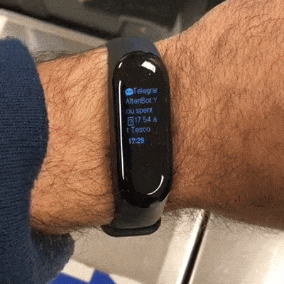

# starling-bank-notifications-on-telegram

This project enables echoing all [Starling bank](https://www.starlingbank.com/) notifications into [Telegram](https://telegram.org/) using Starling webhooks and Telegram bot. 

## Use case

I use the awesome [Mi Band 3](https://www.mi.com/uk/mi-band-3/) smart band to get important notifications on my wrist. Unfortunately, the official Mi-Fit app for iOS doesn't support notifications from the Starling app.

This project is a hacky way to receive Starling bank notifications on your Mi Band 3 by configuring a Telegram Bot to send you a message with the same content of the original Starling notification whenever an event occurs in your account, e.g., card transaction, direct debit operation or payment received.

